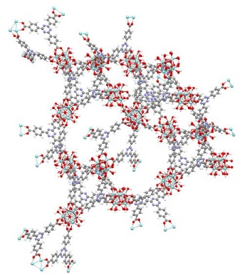
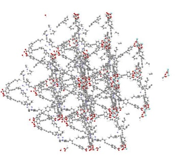
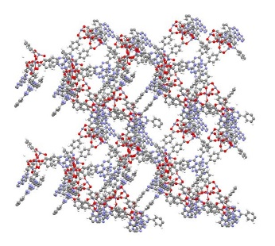
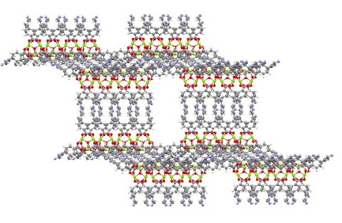
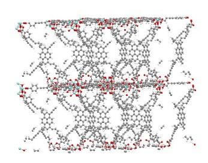

---
author:
- Ezgi Gulcay:
    equal_contributor: yes
    institute:
    - a
    orcid: 0000-0002-8797-9893
- Paul Iacomi:
    equal_contributor: yes
    institute:
    - a
    orcid: 0000-0001-5477-1503
- Kyung Ho Cho:
    institute:
    - b
- Jong-San Chang:
    institute:
    - b
- Guillaume Rioland:
    institute:
    - c
- Sabine Devautour:
    institute:
    - a
    orcid: 0000-0002-3812-7379
- Guillaume Maurin:
    correspondence: yes
    email: guillaume.maurin1\@umontpellier.fr
    institute:
    - a
    orcid: 0000-0002-2096-0450
autoEqnLabels: true
bibliography:
- refs/biblio.bib
cref: false
institute:
- a:
    name: ICGM, Univ. Montpellier, CNRS, ENSCM, F-34095 Montpellier, France
- b:
    name: Research Group for Nanocatalyst (RGN) and ConvergentCenter for Chemical Process (CCP),
      Korea Research Institute of ChemicalTechnology (KRICT), Gajeong-ro 141, Yuseong-gu, Daejeon
      34114, South Korea
- c:
    name: Centre National d'Etudes Spatiales, DSO/AQ/LE, 18 AvenueEdouard Belin, 31401 Toulouse,
      Cedex 09, France
link-citations: true
linkReferences: true
number-sections: true
project:
  title: project
title: "Breaking the Upper Bound of Siloxane Uptake: Metal-Organic Frameworks as an Adsorbent
  Platform"
xnos-capitalise: true
xnos-number-by-section: false
---

# Abstract

Biogas, regarded as a promising renewable energy source, still needs to be upgraded. This calls for
the removal of the most prominent contaminants, among others the octamethylcyclotetrasiloxane (D4)
molecule. Herein, high throughput computational screening in tandem with synthesis and adsorption
testing revealed the hydrophobic Zr-MOF PCN-777 as an optimal D4 adsorbent with record gravimetric
(1.8 g/g) and volumetric (0.49 g/cm^3^) uptakes, alongside a reversible and fast
adsorption/desorption process, good cyclability and easy regeneration. This MOF was demonstrated to
encompass an ideal combination of mesoporous cages and chemical functionality to enable an optimal
packing of the siloxane molecules and their efficient removal while maintaining the process highly
reversible thanks to moderately high host/guest interactions. This work highlights the efficacy of
an integrated workflow for accelerating adsorbent selection for a desired application, spanning the
entire pipeline from method validation to computational screening, synthesis and adsorption testing
towards the identification of the optimal adsorbents.

# Introduction

Biogas capture from landfill sites or wastewater treatment plants is identified as an appealing
strategy to procure a renewable energy fuel, simultaneously promoting a reduction in greenhouse gas
emissions and an increase in waste treatment profitability
[@themelisMethaneGenerationLandfills2007]. The use of biogas as an energy green resource critically
calls for a substantial increase of its $\ce{CH4}$ quality by removing gaseous and vapour impurities
resulting from anaerobic digestion processes [@themelisMethaneGenerationLandfills2007]. One
prominent class of biogas impurities are the linear (denoted "L") and cyclic (denoted "D")
siloxanes, as degradation by-products of silicone polymers from packaging, construction, cosmetics,
and household items
[@takuwaCharacterizationTraceConstituents2009; @ohannessianVolatileOrganicSilicon2008]. This family
of molecules is also known to damage subsequent energy recovery systems, e.g. combustion engines,
fuel cells and steam reformers, via their decomposition into amorphous silica on heated surfaces
that leads to abrasive solid deposits on critical machinery, and to inactivation of gas reforming
catalysts [@wangRecentAdvancesTechnologies2019]. Octamethylcyclotetrasiloxane commonly labelled D4
is the most representative siloxane species present in biogas, which spans from 50 to 70% of the
total siloxane content due to its relatively low water solubility (56 μg/l) and its significant
vapour pressure (196 Pa at 303 K)
[@ohannessianVolatileOrganicSilicon2008; @wangRecentAdvancesTechnologies2019; @dewilEnergyUseBiogas2006].

Multiple technologies have been proposed to mitigate the presence of siloxanes in biogas outlet
streams, including mineral acid/base scrubbing, deep chilling, or iron oxide beds, often working in
tandem to remove other impurities [@kuhnRequirementsTechniquesCosts2017]. The physisorption-based
removal of D4 by porous filters is also a promising alternative, due to its relatively low potential
energetic cost, while avoiding the use of environmentally hazardous chemicals
[@chinStatisticalAnalysisTrace2020; @ajharSiloxaneRemovalLandfill2010]. A variety of conventional
adsorbents has been envisaged for siloxane elimination, including activated carbons
[@finocchioDecompositionHexamethylcyclotrisiloxaneSolid2008], zeolites
[@montanariPurificationLandfillBiogases2010], and silicas
[@sigotAdsorptionOctamethylcyclotetrasiloxaneD42015]. However, these materials suffer from several
drawbacks that limit their use, in particular insufficient uptake and/or incomplete regeneration
under standard conditions. Moreover, downstream biogas commonly contains a proportion of water,
which can compete with D4 sorption when using hydrophilic adsorbents
[@kuhnRequirementsTechniquesCosts2017; @schweigkoflerRemovalSiloxanesBiogases2001]. Therefore,
finding a high capacity adsorbent capable of removing siloxanes under moderate humidity conditions
in a reversible manner remains a challenge.

{#fig:overview
width="95%"}

Metal-Organic Frameworks (MOFs) are one of the most recent classes of porous adsorbents. These
coordination polymers are built from the assembly of metal nodes and organic multidentate linkers to
form architectures of different dimensionality from 1D to 4D
[@fereyHybridPorousSolids2008; @zhouIntroductionMetalOrganic2012; @evansFourdimensionalMetalorganicFrameworks2020].
Their near-infinite diversity, thanks to a wide set of building blocks, has made this class of
porous solids promising for applications in gas/vapour adsorption/separation
[@siegelmanChallengesOpportunitiesAdsorptionbased2019; @linMicroporousMetalOrganicFramework2020],
catalysis [@bavykinaMetalOrganicFrameworks2020], and sensing
[@allendorfElectronicDevicesUsing2020; @woellnerAdsorptionDetectionHazardous2018] among others.
Their high and uniform porosity combined with extensive chemical tunability of their pore walls
suggest that MOFs may hold promise as candidates for siloxane adsorption. Insofar only two studies
have attempted to investigate the potential of MOFs for D4 removal. Mito-Oka and co-workers
[@mito-okaSiloxaneD4Capture2013] proposed DUT-4 ($\ce{[Al(OH)(2,6-ndc)}$, DUT: Dresden University of
Technology), a wine rack-like MOF, as a first potential adsorbent. Although its hydrophobicity makes
this MOF attractive for D4 elimination under humidity, its adsorption capacity of 0.15 g/g,
estimated through single component by TGA measurements, is rather low and its regeneration can only
be achieved at very high temperature, over 523 K, resulting from a high confinement of D4 (kinetic
diameter of 8.6 Å) in its channels (9 Å × 9 Å). More recently, MIL-101(Cr)
($\ce{Cr3O(OH)(H2O)2(btc)3}$, MIL: Material of Institute Lavoisier), a well-known highly porous MOF
incorporating two types of mesoporous cages with diameters of 29 Å and 34 Å was demonstrated to
exhibit a much higher D4 uptake of 0.95 g/g at 298 K, however its regeneration was only possible
upon heating at 423 K under vacuum [@gargiuloChromiumbasedMIL101Metal2019]. Further, since
MIL-101(Cr) is known to be highly hydrophilic [@zhaoSynthesisMIL101Cr2020] we can expect a
substantial drop of its D4 uptake performance even under low-relative humidity. Indeed, neither of
these MOFs tested so far combines a large D4 uptake, low-energy regeneration and hydrophobicity to
avoid a preferential adsorption of $\ce{H2O}$ over D4 under low to moderate relative humidity.

To date, only a very small number of MOFs has been sampled for this application, and therefore
relied on researchers' intuition to identify promising adsorbents. There are, however, a myriad of
hydrophobic MOFs that can potentially perform better for D4 adsorption. Since it is unfeasible to
individually test the performances of all the existing MOFs, several high throughput computational
screening (HTCS) workflows have been devised which identified promising MOFs for diverse
adsorption-related applications
[@simonWhatAreBest2015; @parkEstablishingUpperBounds2017; @moghadamComputeraidedDiscoveryMetal2018; @boydDatadrivenDesignMetal2019; @shiMachineLearningSilico2020; @yaoInverseDesignNanoporous2021].
However, such a computational strategy can only be successful if conducted in strong interplay with
a careful analysis of the best-predicted MOF performers in terms of chemical/thermal stability under
the target working conditions as well as ease of synthesis/activation. This enables the selection of
the MOF candidate with the best overall compromise for further adsorption testing to confirm the
expectation.

With this in mind, we herein devise a hand-in-hand computational-experimental strategy whose
workflow is summarized in [@fig:overview]. As a first stage, the CoRE (Computation-Ready,
Experimental) MOF 2019 database [@chungAdvancesUpdatesAnalytics2019] was computationally screened
with the objective to identify hydrophobic materials showing a D4 uptake higher than the current MOF
benchmark, e.g. MIL-101(Cr). From the top 56 best MOF performers, we selected the Zr
carboxylate-based mesoporous PCN-777 (PCN for Porous Coordination Network) for further experimental
testing. This MOF was demonstrated to exhibit not only a record D4 uptake (1.8 g/g) to date for a
crystalline porous material, but also exceptional cycling and low-energy regeneration without the
need for thermal treatment, while its confirmed hydrophobicity strongly suggests a preservation of
its adsorption performance under low to moderate relative humidity conditions. An in-depth analysis
of the adsorption mechanism further revealed the dominant host-guest interactions that control the
adsorption of the first D4 molecules and their effective packing in the whole porosity up to
saturation.

# Methodology

## Computational methods {#methodology-computational}

The CoRE (Computation-Ready, Experimental) MOF 2019 database [@chungAdvancesUpdatesAnalytics2019]
was considered in this work. The geometric characterization of MOFs, including pore limiting
diameters (PLDs), densities, $\ce{N2}$-accessible surface areas (SAs), pore volumes (PVs) and void
fractions ($\phi$), were calculated by Zeo++ software [@willemsAlgorithmsToolsHighthroughput2012].
All Monte Carlo simulations were performed with the RASPA simulation package
[@dubbeldamRASPAMolecularSimulation2016]. Henry coefficients of $\ce{H2O}$ ($K_{H,H_{2}O}$) and
isosteric enthalpy of adsorption ($\Delta
H_{st,H_{2}O}^{0}$) values were initially computed at 298 K for all MOFs using the Widom particle
insertion method [@frenkelUnderstandingMolecularSimulation2002]. These simulations were carried out
using 1 × 10^5^ production cycles and 5 × 10^4^ cycles for equilibration. We applied the same Widom
insertion method to calculate isosteric enthalpy of adsorption at low coverage for D4 in DUT-4 and
PCN-777 with the consideration of 1 × 10^6^ production cycles and 5 × 10^5^ steps for equilibration.
Continuous fractional component Monte Carlo (CFCMC) simulations were performed to evaluate the
saturation D4 uptake of all the selected hydrophobic MOFs at 298 K. All CFCMC simulations were
carried out for a total of 1 × 10^4^ cycles with 5 × 10^3^ cycles for equilibration. A cycle
consists of N Monte Carlo steps, where N is equal to the number of molecules (which fluctuates
during a CFCMC simulation). For each cycle, random insertion, rotation, translation and
continuous-fractional swap moves were attempted. The D4/MOF and $\ce{H2O}$/MOF interactions were
described by the sum of van der Waals (LJ) and Coulombic terms. The electrostatic interactions were
calculated by the Ewald summation [@ewaldBerechnungOptischerUnd1921] while a cut-off radius of 12.8
Å was considered for the van der Waals term. Cell lengths of the simulations were increased to at
least 25.6 Å in each three dimensions and all MOF frameworks were considered as rigid in the
simulations. Atomic charges for all atoms in the MOFs were estimated using Extended Charge
Equilibration (Qeq) method as implemented in RASPA [@dubbeldamRASPAMolecularSimulation2016] and
their LJ parameters were taken from the UFF forcefield as currently employed
[@qiaoHighthroughputComputationalScreening2017; @keskinProgressOpportunitiesChallenges2009]. H2O was
modelled using TIP4P/2005 [@abascalGeneralPurposeModel2005]. D4 was described by a semi-flexible all
atom model with intramolecular parameters taken from the consistent-valence force field (CVFF)
[@dauber-osguthorpeStructureEnergeticsLigand1988]
([@tbl:ff-d4-bond;@tbl:ff-d4-bend;@tbl:ff-d4-dihedral;@tbl:ff-d4-cross-bond;@tbl:ff-d4-cross-bondbend],
SI) while the LJ parameters for all atoms were taken from the UFF forcefield as done in earlier work
[@xuSolvationForceSimulations2014] and their charges were calculated at the DFT level
([@tbl:ff-d4-charge], SI).

All the results of the HCTS are available as CSV files in the SI. A web-based explorer, which can be
used to interactively display the dataset is available at <https://pauliacomi.com/mof4d4>.

## MOF sorbents {#methodology-benchmark}

The benchmark MIL-101(Cr) sample was taken from a previous work
[@pillaiCapturePerformancesHybrid2017], with all textural characteristics as stated in reference.
DUT-4 was purchased from Materials Center (TU Dresden, Germany). PXRD, TGA and $\ce{N2}$
physisorption measurements for DUT-4 are available in the SI ([@fig:dut4-summary]). BET surface
areas of 3475 m^2^/g and 1610 m^2^/g were determined for MIL-101(Cr) and DUT-4, respectively.
PCN-777 was synthesised by optimizing a previous published methodology
[@fengHighlyStableZeotype2015]. Full synthesis methodology, activation procedure and phase purity
analysis using TGA, PXRD and $\ce{N2}$ physisorption are given in the SI. All samples were activated
at 423 K under vacuum adsorption experiments.

## Material characterization {#methodology-characterization}

PXRD patterns were recorded on a Panalytical X'Pert PRO PXRD diffractometer with a Cu $K_{\alpha}$
radiation source, in a Bragg-Brentano reflection geometry, using a spinning sample holder with a
low-background silicon insert. $\ce{N2}$ isotherms at 77 K were recorded in a Micromeritics Tristar
manometric analyser (displayed in [@fig:n2-phys], SI). The Brunauer-Emmet-Teller area was calculated
using the pyGAPS suite [@iacomiPyGAPSPythonbasedFramework2019], with the application of the
Rouquerol rules for isotherm region selection yielding a minimum Pearson correlation coefficient of
$R=0.997$ (see [@fig:n2-analysis] for resulting fitting).

## D4 sorption experiments {#methodology-d4sorption}

Sorption measurements were gravimetrically recorded using a dynamic method in a DVS Vacuum
instrument (Surface Measurement Systems, UK). In this setup, a continuous adsorbate flow sourced
from the headspace of a reservoir enters the sample enclosure, passes the suspended sample pan, and
is entrained by a vacuum system. Pressure is controlled by a butterfly valve located before the
outlet. Uptake is monitored by a magnetically suspended balance, capable of measuring mass changes
at a resolution of 0.1 μg. The entire apparatus is kept in a temperature-controlled chamber to avoid
any condensation points. For each experiment, a stainless-steel sample pan is first tared, then
loaded with about 10 mg of sample. The sample is activated *in situ* under dynamic vacuum (1E-2 Pa)
to 423 K. The adsorption-desorption isotherms for D4 and $\ce{H2O}$ and subsequent repeats were
recorded at 303 K in the 0-10 Pa range of pressure. Adsorption cycling was similarly recorded,
switching between two setpoints of low (0.5 Pa) and high pressure (10 Pa). The D4 used for the
sorption experiments was sourced from Sigma Aldrich, with minimum 98% purity.

![ (a) Predicted D4 uptake performance at 298 K for the hydrophobic MOF database plotted as a
function of computed $\Delta
        H_{st,H_{2}O}^{0}$, and colour coded by void fraction, $\phi$. Top performing 10 candidates
are represented by different symbols in the legend. (b) Relation between gravimetric (g/g) and
volumetric (g/cm^3^) D4 uptake for all MOFs at 298 K. Marker size represents PV while colour denotes
$\phi$. Dashed line represents the gravimetric and volumetric uptake of benchmark
MIL-101(Cr)[@gargiuloChromiumbasedMIL101Metal2019]. (c) The structure of our promising material
identified for D4 uptake, PCN-777. Zr, N, O, C, and H atoms are depicted in light blue, dark blue,
red, dark grey, and light grey, respectively. ](figs/screening.png){#fig:d4-screening width="90%"}

# Results and discussion

## Pre-selection of hydrophobic MOFs {#pre-screening}

We used the CoRE-MOF 2019 database [@chungAdvancesUpdatesAnalytics2019] (over 14 000 MOFs), recently
updated to remove solvent molecules and disordered structures, to which we also added further 29
well-known MOFs owing to their good chemical/thermal stability and permanent accessible porosity
(listed in [@tbl:extra-mofs] SI). We first excluded all structures with PLDs lower than 6 Å, a
threshold selected as the average between the kinetic diameter of D4 (8.6 Å) and the effective
diameter of its constitutive inner Si-O ring (4.5 Å). A total of 1739 remaining non-disordered MOFs
were further considered, their geometric and textural properties, i.e. PV, SA, and $\phi$, as well
as their density ($\rho$) being summarized in [@fig:d4-screening-geometric].

As siloxane-rich biogas streams often contain water vapour, the optimal D4 adsorbent should have a
relatively low water affinity to avoid competing adsorption. Moreover, hydrophobic MOFs are known to
possess increased resistance to the hydrolysis of the metal-linker bond
[@burtchWaterStabilityAdsorption2014; @wuEnhancingStabilityMetalorganic2010], alleviating long-term
water stability concerns. Therefore, we screened the water affinity of the 1739 MOFs by computing
their Henry coefficient of water ($K_{H,H_{2}O}$) and the isosteric enthalpy of adsorption at
infinite dilution ($\Delta H_{st,H_{2}O}^{0}$) at 298 K using the Widom particle insertion method
[@frenkelUnderstandingMolecularSimulation2002]. This approach is generally applied in HTCS studies,
providing a quick way to gauge the hydrophobicity/hydrophilicity of MOFs
[@matito-martosDiscoveryOptimalPorous2018; @qiaoHighthroughputComputationalScreening2017]. All the
computational details including the force fields used to describe both MOFs and water are provided
in the methodology section and SI. In the frame of biogas upgrading, an extremely hydrophobic
adsorbent is not required since the water content usually ranges from 38% to 85% relative humidity
[@wangRecentAdvancesTechnologies2019], therefore the following thresholds were applied to select
MOFs with moderate to high hydrophobicity: $K_{H,H_{2}O}$ \< 1 × 10^−5^ mol/kg/Pa and
$\Delta H_{st,H_{2}O}^{0}$ \< 33 kJ/mol (below the vaporization enthalpy of water \~40 kJ/mol)
[@lemmonNISTStandardReference2018]. As a frame of reference, the highly hydrophobic ZIF-8 is
characterized by $K_{H,H_{2}O} =$ 2.5E-6 mol/kg/Pa and $\Delta H_{st,H_{2}O}^{0} =$ 30 kJ/mol
[@moghadamEfficientIdentificationHydrophobic2016]. Overall, among the 1739 MOFs, 811 structures (47%
of our material library) were predicted to fulfill these two criteria. This hydrophobic MOF dataset
encompasses structures of density ranging from 0.24 g/cm^3^ to 2.04 g/cm^3^ and with a wide range of
geometric and textural features: 6 Å \< PLD \< 36 Å, 0.42 \< $\phi$ \< 0.90, 0.27 cm^3^/g \< PV \<
3.72 cm^3^/g and 320 m^2^/g \< SA \< 6700 m^2^/g, as shown in [@fig:d4-screening-geometric].

## Prediction of the D4 uptake performance for the hydrophobic MOFs {#d4-screening}

The D4 adsorption uptakes for the selected MOFs were simulated using single point continuous
fractional component Monte Carlo (CFCMC) [@rahbariRecentAdvancesContinuous2020]. In these
calculations, the framework atoms were maintained fixed in their crystallographic positions and D4
was modelled as a semi-flexible molecule with its Si-O ring maintained rigid. Full computational
details, including force field parameters and partial charges for D4 are available in the
methodology section and SI.

::: {#tbl:top10}
  ------------------ ------- ------- ----------- ----------- -------- --------------------- ---------------------------- ---------------- ------------------
         MOF           PLD     SA      $\rho$        PV       $\phi$     $K_{H,H_{2}O}$      $\Delta H_{st,H_{2}O}^{0}$   Gravimetric D4    Volumetric D4
                       (Å)    (m/g)   (g/cm^3^)   (cm^3^/g)                (mol/kg/Pa)                (kJ/mol)             uptake (g/g)    uptake (g/cm^3^)
   FOTNIN (PCN-777)   28.36   2990      0.27        3.31       0.90    $2.80\times10^{-6}$              7.82                   2.68              0.72
        RUTNOK        14.65   6200      0.24        3.72       0.90    $6.70\times10^{-6}$             14.81                   2.57              0.62
        CUSYAR        12.18   5700      0.25        3.65       0.90    $3.42\times10^{-6}$              8.15                   2.35              0.59
        WUHDAG        10.50   5500      0.29        2.99       0.87    $4.69\times10^{-6}$             16.28                   2.01              0.58
        HOHMEX        14.89   5000      0.32        2.74       0.87    $4.66\times10^{-6}$             13.24                   1.97              0.63
        ECOKAJ        17.58   3600      0.33        2.68       0.87    $6.89\times10^{-6}$             17.20                   1.97              0.65
        DAJWET        26.59   5000      0.28        3.06       0.87    $7.73\times10^{-6}$             17.92                   1.93              0.54
        RUBDUP        19.25   4200      0.30        2.90       0.87    $3.79\times10^{-6}$             11.62                   1.93              0.58
        WUHCUZ        12.21   5500      0.30        2.91       0.87    $3.75\times10^{-6}$             12.94                   1.80              0.54
        ADATAC        10.28   5130      0.34        2.57       0.87    $4.16\times10^{-6}$             12.78                   1.68              0.57
  ------------------ ------- ------- ----------- ----------- -------- --------------------- ---------------------------- ---------------- ------------------

  :  Top 10 promising hydrophobic MOF materials identified for D4 uptake at 298 K.
:::

As a validation stage of the computational method, the D4 uptakes for MIL-101(Cr) and DUT-4 were
first predicted and compared with the available experimental data. The simulated uptake for
MIL-101(Cr), the current best MOF performer, was found to be 1.03 g/g vs. 0.95 g/g as reported in
the original experimental study [@gargiuloChromiumbasedMIL101Metal2019]. We equally confirmed the
good agreement between the calculated and the experimental D4 uptake by recording an additional
adsorption isotherm on a MIL-101(Cr) sample (see methodology section), finding a D4 capacity of
1.15 g/g at 298 K. The D4 uptake for DUT-4 was however predicted to be substantially higher
(0.42 g/g) than the experimental value reported previously of 0.15 g/g
[@mito-okaSiloxaneD4Capture2013]. We therefore collected a D4 adsorption isotherm on a pristine
DUT-4 sample (sourcing and textural properties in methodology section and SI), finding a D4 uptake
of 0.5 g/g ([@fig:d4-benchmark]), more in line with our theoretical assessment. The lower D4
capacity reported in the original study is attributed to the method used to quantify the adsorbed
amount, based on mass loss upon heating. It is likely that only a fraction of D4 was released, since
D4 was demonstrated to strongly interact with DUT-4 due to a high confinement in its pores
[@mito-okaSiloxaneD4Capture2013].

Overall, the good agreement between the simulated uptakes and experimental data for the previously
investigated MOFs served to validate both the applicability of our computational method and the
reliability of our experimental setup. This further highlights the importance of a dual
experimental-computational approach even prior to starting the high-throughput screening. We then
transitioned towards the search for better performers amongst the 811 identified hydrophobic MOFs.
[@fig:d4-screening]a reports their computed D4 uptakes vs. their $\Delta H_{st,H_{2}O}^{0}$ values
at 298 K, with a similar correlation depicted vs. $K_{H,H_{2}O}$ in [@fig:d4-screening-henryc], SI.
The dashed line represents the current known upper bound for D4 uptake in MOFs, considering
MIL-101(Cr) as the benchmark sorbent (0.95 g/g) [@gargiuloChromiumbasedMIL101Metal2019]. 56
hydrophobic MOFs were predicted to be more attractive candidates than MIL-101(Cr) on the basis of
gravimetric D4 uptake. Common geometric and textural features of these MOF candidates are void
fractions $\phi$ larger than 0.81 and pore volumes (PV) higher than \~1.7 cm^3^/g. Typically, the
relation between gravimetric D4 uptake and PV is shown in [@fig:d4-screening-grav-volum].

The 10 best MOFs showing the highest D4 uptakes ranging from 1.68 to 2.68 g/g are highlighted in
[@fig:d4-screening]a by their Cambridge Structural Database (CSD)
[@allenCambridgeStructuralDatabase2002] refcode and listed in [@tbl:top10]. Notably, all these
identified candidates were found to be highly hydrophobic with associated $K_{H,H_{2}O}$ of about
5E-6 mol/kg/Pa and their $\Delta H_{st,H_{2}O}^{0}$ ranging from 8 to 18 kJ/mol which make these
adsorbents also potentially effective under moderate humidity conditions. [@tbl:top10] shows that
the highly hydrophobic FOTNIN is predicted to exhibit the highest saturated D4 uptake (2.68 g/g), in
relation with its high PV (3.31 cm^3^/g) and large mesoporous cages (33.7 Å × 28.4 Å). Remarkably,
this gravimetric D4 loading translates into a spectacular improvement as compared to MIL-101(Cr)
[@gargiuloChromiumbasedMIL101Metal2019]. RUTNOK (common name IRMOF-76
[@oisakiMetalOrganicFramework2010]) gave almost a similar D4 uptake (2.57 g/g) as FOTNIN, in part
due to similar PV (3.72 cm^3^/g) and $\phi$ (0.9). Other candidates exhibit high D4 uptakes,
including CUSYAR (also known as MOF-210 [@furukawaUltrahighPorosityMetalOrganic2010]), WUHDAG and
WUHCUZ (NU-1104, and NU-1103 [@wangUltrahighSurfaceArea2015], respectively). Full structural
properties of these 10 MOFs including organic ligands and metal sites are given in
[@tbl:top-mofs-detail].

In the scope of the practical application of a sorbent for a filter bed or column, volumetric uptake
is a reliable metric due to its direct relation to equipment sizing. Trade-offs between gravimetric
and volumetric uptakes have been previously reported for the storage of various fluids using porous
materials [@moghadamComputeraidedDiscoveryMetal2018]. [@fig:d4-screening]b shows the relation
between the computed gravimetric and volumetric D4 uptakes for the hydrophobic MOFs database. Unlike
gravimetric uptake which increases indefinitely, the volumetric uptake in porous materials is
limited by the density of the adsorbate fluid phase, to which it asymptotically approaches as
framework density decreases (and void fraction increases)
[@bobbittHighthroughputScreeningMetal2016]. Interestingly FOTNIN remains the top MOF performer in
terms of volumetric uptake as well (0.72 g/cm^3^). This MOF (common name PCN-777
[@fengHighlyStableZeotype2015]) is built from large planar tritopic linkers
(4,4',4' '-s-triazine-2,4,6-triyl-tri-benzoate or TATB) coordinated to $\ce{Zr6}$-oxoclusters in an
antiprismatic fashion, forming vertex-sharing supertetrahedra surrounding a mesoporous cage of 33.7
Å as depicted in [@fig:d4-screening]c. These cages are interconnected by hexagonal windows (30 Å)
and are typically decorated by $\ce{OH/H2O}$ moieties coordinated to the remaining axial positions
of the $\ce{Zr6}$ node.

![ (a) Single component adsorption/desorption isotherms for D4 (blue) and $\ce{H2O}$ (red) collected
at 303 K for PCN-777 in the pressure range of 0-10 Pa (corresponding to 0--0.05 p/p^0^ for D4).
Solid and open symbols represent adsorption and desorption branches, respectively. (b) Comparison of
the D4 capacity of MOFs investigated in the present study with other classes of porous materials
(data from @wangRecentAdvancesTechnologies2019), with error bars placed at one standard deviation of
mean capacity. (c) 5 D4 sorption-desorption cycles recorded after the first two isotherms on
PCN-777, in the same pressure range. (d) PXRD of pristine PCN-777 (black) and samples recovered
after D4 cycling (blue) and water adsorption (red). ](figs/d4-experiment.png){#fig:d4-experiment
width="95%"}

## Experimental assessment of the D4 sorption performance for the top MOF {#assessment}

While HTCS enabled a rapid and effective screening on the performance indicator, additional
criteria, such as thermal/chemical stability, synthesis route, activation conditions, precursor
toxicity and linker availability need to be considered to select the optimal adsorbents. We
therefore critically assessed PCN-777 prior to further experimental action. Our selection criteria
for PCN-777 were (i) the excellent known stability of the oxo-Zr-carboxylate metal node, at the
origin of the high chemical and thermal resistance of the framework, alongside with (ii) the
commercially available linker and well-controlled synthesis procedure documented elsewhere
[@fengHighlyStableZeotype2015; @liuPhotocatalyticHydrogenProduction2018]. Indeed, this material was
synthesised accordingly (details provided in the methodology section).

The D4 adsorption isotherm for PCN-777 was first recorded up to 10 Pa at 303 K using a dynamic
vapour sorption system (experimental details in the methodology section). The resulting isotherm,
depicted in [@fig:d4-experiment]a, exhibits a characteristic type V shape
[@thommesPhysisorptionGasesSpecial2015] with a sharp D4 uptake increase above 7 Pa up to a maximum
of 1.8 g/g that translates into 0.49 g/cm^3^. This value is however lower than the predicted uptake
due to two combined reasons: (i) an incomplete evacuation of the porosity (theoretical
PV=3.3 cm^3^/g vs the experimental one of 2.2 cm^3^/g determined through $\ce{N2}$ physisorption at
77 K, in [@fig:n2-phys], SI) commonly observed for mesoporous MOFs
[@nelsonSupercriticalProcessingRoute2009; @parkCrystalStructureGuest2007] and (ii) only a partial
accessibility of the super-tetrahedral cages to D4 owing to their relatively small windows. Indeed,
while optimized synthesis and activation procedures may recover more of the expected porosity, the
attained D4 uptake constitutes a record among porous solids. This positions PCN-777 as the porous
material with the highest currently known D4 uptake, almost twice higher than the benchmark
MIL-101(Cr), 5--10 times that of the most promising silicas and zeolites, and above the best
performing activated carbons as illustrated in [@fig:d4-experiment]b
[@wangRecentAdvancesTechnologies2019]. Notably, the step-like adsorption behaviour is ideal from the
application point of view of a breakthrough filter, as it ensures a narrow mass transfer zone and
minimises the column dead zone at break point. Remarkably, the maximum uptake for PCN-777 is
attained at low pressure of 7 Pa that makes this MOF highly promising for D4 removal in a gas phase
concentration below 75 ppm.

Throughout desorption (dotted line with open symbols in [@fig:d4-experiment]a), a small hysteresis
occurs with a width of about 1 Pa. Under complete vacuum, a minute amount of D4, about 0.1 g/g, i.e.
5% of total capacity, is retained in the structure. We attribute this capacity loss to D4 molecules
irreversibly trapped in the super-tetrahedral cages or on a small fraction of defect sites. Overall,
PCN-777 acts as a highly reversible D4-adsorbent. A second sorption cycle reveals the excellent
repeatability of D4 sorption by this MOF, with identical condensation pressure and total uptake, the
adsorption-desorption branches now overlapping in the very low-pressure region
([@fig:d4-experiment]a).

![ Representative snapshots of the preferential sitting of D4 in the pores of PCN-777 at 298 K for
increasing loading at (a) 10% with highlighted interactions distance between D4 and the MOF
framework, and at (b) 40%, (c) 65%, and (d) 100% fractional loading ($\theta$). Framework atoms
(sticks) and D4 molecules (lines, and ball and sticks) are coded as Zr, N, O, Si, C, and H atoms in
light blue, dark blue, red, yellow, dark grey, and light grey respectively. The separating distance
is represented by dashed black lines and reported in Å. ](figs/mechanistic.png){#fig:d4-mechanistic
width="70%"}

To further investigate the D4 adsorption-desorption cyclability of PCN-777, a subsequent set of five
cycles was recorded on the same sample, covering the entire uptake range from fully loaded to empty
under a medium vacuum level of 0.5 Pa (see [@fig:d4-experiment]c). No further capacity loss is
observed after the initial 5 wt% from cycle 1 to cycle 2 with a pressure drop sufficient to fully
remove adsorbed D4 in every cycle without the need of thermal treatment. This is a leap forward
compared to the previous MOF candidates, i.e. MIL-101(Cr) and DUT-4. The former was reported
[@gargiuloChromiumbasedMIL101Metal2019] to be fully regenerable at only high temperatures (outgassed
under vacuum at 423 K), and we note that vacuum alone was unable to fully desorb D4, with nearly 50%
of siloxane remaining in the structure after desorption in our experiments ([@fig:d4-benchmark],
SI). D4 adsorption in DUT-4 is even more irreversible, owing to the strong confinement of the
siloxane molecules in its pores [@mito-okaSiloxaneD4Capture2013], with essentially no desorption
observed under vacuum ([@fig:d4-benchmark], SI). The global sorption kinetics was further
qualitatively evaluated by observing the equilibration time throughout cycling steps.
[@fig:d4-experiment]c reveals that an adsorption/desorption cycle can be achieved in less than 30
minutes. Such a fast kinetics is a clear advantage for practical use. In addition, the water
adsorption collected for PCN-777 further confirmed its predicted hydrophobicity and revealed that
below $P=$7 Pa, water loading is negligible, i.e. under 0.02 g/g (see [@fig:d4-experiment]a). This
observation strongly suggests that PCN-777 is expected to maintain its high-level performance for D4
removal under low to moderate humidity working conditions.

Finally, stability of PCN-777 after its use as a D4 adsorbent was evaluated by checking its
crystallinity and porosity. PXRD patterns recorded after the D4 cycling experiments show similar
Bragg peak positions and broadenings as the pristine material, testifying that no amorphisation or
decrease of crystallinity were incurred ([@fig:d4-experiment]d). The same conclusion holds true for
PCN-777 upon water adsorption. Further, $\ce{N2}$ adsorption isotherms collected at 77 K for PCN-777
after $\ce{H2O}$ and D4 adsorption both present a similar shape than that of the pristine solid (see
[@fig:n2-phys]) while slightly lower pore volume (1.87 cm^3^/g vs 2.20 cm^3^/g) and BET area
(1544 m^2^/g vs 1730 m^2^/g) were obtained for the material after D4 cycling, attributed to the
small amount of D4 retained in the porous framework during the first adsorption cycle.

## Adsorption mechanism

A careful analysis of the adsorption mechanism of D4 in PCN-777 was further explored by considering
MC simulations in the canonical ensemble with increasing loading up to the saturation (see
methodology section for computational details). At the initial stage of adsorption, the coordinated
OH/$\ce{H2O}$ moieties of the MOF $\ce{Zr6O4}$ polyhedra pointing towards the pore were found to act
as primary adsorption sites ([@fig:d4-mechanistic]a). The D4 molecule interacts mostly via its
methyl group with an averaged separating $\ce{H(CH3)-H(H2O)}$ distance of 2.8 Å (see the radial
distribution function plotted for the corresponding pair in [@fig:d4-rdf]a) as illustrated in
[@fig:d4-mechanistic]a. This preferential sitting of D4 is associated with a moderately high
simulated adsorption enthalpy of 83.5 kJ/mol in line with the isosteric heat of adsorption we
assessed experimentally that ranges from 65 and 75 kJ/mol ([@fig:isosteric-enth]). Both values are
slightly higher than the enthalpy of liquefaction of D4 at 303 K as 54.5 kJ/mol
[@lemmonNISTStandardReference2018]. We further demonstrated that this value remains substantially
lower than the one simulated for DUT-4 (194.0 kJ/mol) for which the adsorption of D4 is governed by
a high degree of confinement leading to an irreversible process. This observation clearly states
that the adsorption energetics in PCN-777 offers a good compromise to ensure an efficient adsorption
of D4 as well as an almost fully reversible and fast adsorption/desorption process. While increasing
the loading, D4 molecules tend to form a monolayer near the wall of the cage owing to their
interactions with both the organic linkers and inorganic nodes of the MOF as shown in
[@fig:d4-mechanistic]b-c. Finally, at higher loading, the molecules form multilayers and further
occupy the whole cage corresponding to the scenario of the capillary condensation
([@fig:d4-mechanistic]d). This effective packing is governed by guest-guest interactions involving
averaged separating $\ce{H(CH3)-H(CH3)}$ distance of 2.7 Å at saturation (the radial distribution
function plotted for this pair is shown in [@fig:d4-rdf]b). Such pore filling mechanism has been
commonly observed in diverse mesoporous materials for a range of molecules
[@rouquerolAdsorptionPowdersPorous2013]. Indeed, PCN-777 exhibits an ideal combination of a large
cage to enable an effective packing of the siloxane molecules and the presence of moieties
accessible to D4 to favour host/guest interactions strong enough to ensure an efficient trapping of
the D4 molecules initially adsorbed.

# Conclusions

In this work, a high throughput computational screening first identified a series of hydrophobic
MOFs with octamethylcyclotetrasiloxane uptakes outperforming by far the performance of the
conventional adsorbents. The best-predicted MOF performer, PCN-777, was synthesized and its
predicted exceptional adsorption capacity for this typical contaminant present in biogas was further
experimentally confirmed. This stable MOF was demonstrated to exhibit record gravimetric (1.8 g/g)
and volumetric (0.49 g/cm^3^) uptake alongside with a reversible and fast adsorption/desorption
process, very good cyclability and easy regeneration under continuous pressure cycling owing to a
step-like sorption isotherm. The attractiveness of PCN-777 was found to result from a synergistic
combination of mesoporous cages and chemical functionality pointing towards the center of the cages
to ensure moderately high host/guest interactions and favour an efficient removal of D4 at low
pressure and an efficient packing of the siloxane molecules at higher pressure while maintaining the
process highly reversible. Moreover, its hydrophobicity makes this MOF promising for the selective
removal of siloxanes in moderate humidity conditions. In a broader sense, this study highlights the
efficacy of an integrated workflow for accelerating the selection of adsorbents for a target
application, spanning the entire pipeline from method validation to computational screening,
synthesis, adsorption testing and finally identification of the optimal candidates.

# Acknowledgements {#acknowledgements .unnumbered}

We thank Centre National d'Etudes Spatiales for research funding (R&T n° R-S20/MT-0002-03 and PhD).
PXRD experiments were performed with the support of the Balard Plateforme d'Analyses et de
Caractérisation (PAC Balard).

# Author contributions {#author-contributions .unnumbered}

There are no conflicts of interest to declare.

# Supplementary Information

## Computational details {#si-computational-details}

### Force field parameters for D4

D4 was modelled as a semi-flexible molecule with an all atom atomistic model. All intramolecular
bonds, angles, dihedrals, and cross terms parameters for methyl groups were taken from the
consistent-valence force field (CVFF). [@dauber-osguthorpeStructureEnergeticsLigand1988]

**Harmonic Bond**

$$U = \frac{1}{2}p_{0}{(r - p_{1})}^{2}$$

where $p_0 / \kappa_B$ in units K/Ų, $p_{1}$ in Å.

::: {#tbl:ff-d4-bond}
  Pseudo atom   Type of bond    $p_0 / \kappa_B$ (K/Ų)   $p_{1}$ (Å)
  ------------- --------------- ------------------------- -------------
  Si-O          RIGID_BOND      \-                        \-
  Si-C          HARMONIC_BOND   286248.126                1.809
  C3-H          HARMONIC_BOND   409668.576                1.105

  :  D4 bonding potential parameters.
:::

**Harmonic Bend**

$$U = \frac{1}{2}p_{0}{(\theta_{\text{ijk}} - p_{1})}^{2}$$

where $p_0 / \kappa_B$ in units K/rad², $p_{1}$ in degree.

::: {#tbl:ff-d4-bend}
  Pseudo atom   Type of angle   $p_0 / \kappa_B$ (K/rad²)   $p_1$ (°)
  ------------- --------------- --------------------------- -----------
  Si-C-H        HARMONIC_BEND   41614.223                   112.3
  C-Si-C        HARMONIC_BEND   53400.911                   113.5
  C-Si-O        HARMONIC_BEND   53040.094                   117.3
  H-C-H         HARMONIC_BEND   47507.567                   106.4

  :  D4 bending potential parameters.
:::

**CVFF Dihedral**

$$U = p_{0}{(1 + cos(p_{1}\phi_{\text{ijk}} - p_{2}))}^{2}$$

where $p_0 / \kappa_B$ in units K, $p_2$ in degree.

::: {#tbl:ff-d4-dihedral}
  Pseudo atom   Type of torsion   $p_0 / \kappa_B$ (K)   $p_1$ (multiplicity)   $p_2$ (°)
  ------------- ----------------- ---------------------- ---------------------- -----------
  H-C-Si-C      CVFF_DIHEDRAL     240.545                3                      0
  H-C-Si-O      CVFF_DIHEDRAL     -60.136                3                      0
  C-Si-O-Si     CVFF_DIHEDRAL     240.545                3                      0

  :  D4 dihedral potential parameters.
:::

**CFF Bond Bond Cross**

$$U = p_{0}(r - p_{1})(r\prime - p_{2})$$

where $p_0 / \kappa_B$ in units K/Ų, $p_1$ and $p_2$ in Å

::: {#tbl:ff-d4-cross-bond}
  Pseudo atom   Type of bond-bond     $p_0 / \kappa_B$ (K/Ų)   $p_1$ (Å)   $p_2$ (Å)
  ------------- --------------------- ------------------------- ----------- -----------
  Si-C-H        CFF_BOND_BOND_CROSS   14312.406                 0           0
  C-Si-C        CFF_BOND_BOND_CROSS   7336.612                  0           0
  C-Si-O        CFF_BOND_BOND_CROSS   25257.188                 0           0

  :  D4 cross-term bonding potential parameters.
:::

**CFF Bond Bend Cross**

$$U = {(\theta - p}_{0}) [p_{1}(r - p_{2}) + p_{3}(r\prime - p_{4})]$$

where $p_0$ in degrees, $p_1$ and $p_3$ in units K/Å/rad, $p_1$ and $p_2$ in Å.

::: {#tbl:ff-d4-cross-bondbend}
  Pseudo atom   Type of bond-angle    po (°)   $p_1$ (K/Å/rad)   $p_2$ (Å)   $p_3$ (K/Å/rad)   $p_4$ (Å)
  ------------- --------------------- -------- ----------------- ----------- ----------------- -----------
  Si-C-H        CFF_BOND_BEND_CROSS   0        14733.359         0           9742.06           0
  C-Si-C        CFF_BOND_BEND_CROSS   0        781.770           0           0                 0
  C-Si-O        CFF_BOND_BEND_CROSS   0        11425.871         0           27061.27          0

  :  D4 cross-term bonding-bending potential parameters.
:::

**D4 LJ parameters and charges**

The electronic potential (ESP) derived partial charges of D4 were computed by density functional
theory (DFT) calculations with PBE (Perdew-Burke-Ernzerhof) functional
[@perdewGeneralizedGradientApproximation1996] and DNP (double numeric plus polarization) basis set
[@hehreSelfconsistentMolecularOrbital1972], using DMol^3^ module [@delleyAllElectronNumerical1990]
in Materials Studio [@accelrysMaterialsStudio2001] ([@tbl:ff-d4-charge]).

::: {#tbl:ff-d4-charge}
  Pseudo atom   Charge (e^-^)   $\epsilon / \kappa_B$ (K)   $\sigma$ (Å)
  ------------- --------------- --------------------------- --------------
  Si            1.321           202.429                     3.826
  O             -0.763          30.213                      3.118
  C             -0.889          52.873                      3.431
  H             0.2032          22.156                      2.571

  :  Charges and Lennard-Jones parameters for all atoms of D4.
:::

### Screening dataset {#si-screening-dataset}

1710 non-disordered MOFs with pore limiting diameters \> 6 Å were screened from CoRE-MOF database,
to which 29 well-known MOFs were added with proven stability and high porosity, including the MOF-74
isoreticular series [@gulcayBiocompatibleMOFsStorage2019], Cr-soc-MOF-1
[@nandiRevisitingWaterSorption2019], UiO-68 (UiO for University of Oslo), MOF-808,
[@soaresComputationalEvaluationChemical2019] and a several structures originating from Dresden
University of Technology (DUT) and Material of Institute Lavoisier (MIL). This additional list is
given in [@tbl:extra-mofs].

The combined dataset of 1739 MOFs show a broad range of geometric and textural features: PLDs
(6.0--71.5 Å), $\ce{N2}$ accessible SA (320--6770 m^2^/g), density (0.13--2.22 g/cm^3^), $\phi$
(0.42--0.94) and PVs (0.23--7.46 cm^3^/g).

::: {#tbl:extra-mofs}
  MOFs                                                                  Reference                                      MOFs                  Reference
  --------------------------------------------------------------------- ---------------------------------------------- --------------------- -----------------------------------------------------------
  RAVWAO                                                                [@gulcayBiocompatibleMOFsStorage2019]          DUT-5                 [@senkovskaNewHighlyPorous2009]
  RAVWES                                                                [@gulcayBiocompatibleMOFsStorage2019]          DUT-51-Zr             [@bonZrIvHf2012]
  RAVWIW                                                                [@gulcayBiocompatibleMOFsStorage2019]          DUT-67-Zr             [@bonZrHfBasedMetal2013]
  RAVWOC                                                                [@gulcayBiocompatibleMOFsStorage2019]          MIL-68(Al)            [@yangProbingAdsorptionPerformance2012]
  RAVWUI                                                                [@gulcayBiocompatibleMOFsStorage2019]          Cr-soc-MOF-1          [@nandiRevisitingWaterSorption2019]
  RAVXAP                                                                [@gulcayBiocompatibleMOFsStorage2019]          MIP^\[4\]^-177        [@wangPhaseTransformableUltrastable2018]
  RAVXET                                                                [@gulcayBiocompatibleMOFsStorage2019]          MIP-200               [@wangRobustLargeporeZirconium2018]
  RAVXIX                                                                [@gulcayBiocompatibleMOFsStorage2019]          Zr-IPA^\[5\]^         [@wangMesoporousZirconiumIsophthalateMultifunctional2020]
  MIL-125                                                               [@soaresComputationalEvaluationChemical2019]   Ni-BPM^\[6\]^         [@zhengMolecularInsightFluorocarbon2020]
  MOF-808-acetate                                                       [@soaresComputationalEvaluationChemical2019]   Ni-BPP^\[7\]^         [@zhengMolecularInsightFluorocarbon2020]
  MOF-808-formate                                                       [@soaresComputationalEvaluationChemical2019]   Ni-TPM^\[8\]^         [@zhengMolecularInsightFluorocarbon2020]
  NU^\[1\]^-1000                                                        [@soaresComputationalEvaluationChemical2019]   Ni-TPP^\[9\]^         [@zhengMolecularInsightFluorocarbon2020]
  UiO^\[2\]^-68                                                         [@soaresComputationalEvaluationChemical2019]   Ni-MOF-74             [@zhengMolecularInsightFluorocarbon2020]
  Zr6-AzoBDC^\[3\]^                                                     [@soaresComputationalEvaluationChemical2019]   PCN^\[10\]^-224(Ni)   [@fengConstructionUltrastablePorphyrin2013]
  \[1\]NU: Northwestern University; \[2\]UiO: University of Oslo;                                                                            
  \[3\]AzoBDC: azobenzenedicarboxylate;                                                                                                      
  \[4\]MIP: material of the Institute of Porous Materials from Paris;                                                                        
  \[5\]IPA: isophatale; \[6\]BPM: biphenyl-meta;                                                                                             
  \[7\]BPP: biphenyl-para; \[8\]TPM: triphenyl-meta;                                                                                         
  \[9\]TPP: triphenyl-para; \[10\]PCN: Porous coordination network;                                                                          

  :  Details of the 29 MOFs added to the COREMOF database.
:::

{#fig:d4-screening-geometric
width="80%"}

{#fig:d4-screening-hydrophobic
width="80%"}

{#fig:d4-screening-grav-volum width="80%"}

{#fig:d4-screening-henryc width="80%"}

::: {#tbl:top-mofs-detail}
  --------------------------------------------------------------------------------------------------------- --
                                                                                                            
  {height="3cm"}                                                            
  **Metal site:** Zr                                                                                        
  **PLD:** 28.36 Å                                                                                          
  **SA:** 2990 m^2^/g                                                                                       
  **Density:** 0.27 g/cm^3^                                                                                 
  **PV:** 3.31 cm^3^/g                                                                                      
  **$\phi$:** 0.90                                                                                          
  **Gravimetric D4 uptake:** 2.68 g/g                                                                       
  **Volumetric D4 uptake:** 0.72 g/cm^3^                                                                    
                                                                                                            
  {height="3cm"}                                                            
  4,7-bis(4-carboxylphenyl)-1,3-dimethylbenzimidazium-tetrafluoroborate                                     
  **Metal site:** Zn                                                                                        
  **PLD:** 14.65 Å                                                                                          
  **SA:** 6200 m^2^/g                                                                                       
  **Density:** 0.24 g/cm^3^                                                                                 
  **PV:** 3.72 cm^3^/g                                                                                      
  **$\phi$:** 0.90                                                                                          
  **Gravimetric D4 uptake:** 2.57 g/g                                                                       
  **Volumetric D4 uptake:** 0.62 g/cm^3^                                                                    
                                                                                                            
  {height="3cm"}                                                            
  **Metal site:** Zn                                                                                        
  **PLD:** 12.18 Å                                                                                          
  **SA:** 5700 m^2^/g                                                                                       
  **Density:** 0.25 g/cm^3^                                                                                 
  **PV:** 3.65 cm^3^/g                                                                                      
  **$\phi$:** 0.90                                                                                          
  **Gravimetric D4 uptake:** 2.35 g/g                                                                       
  **Volumetric D4 uptake:** 0.59 g/cm^3^                                                                    
                                                                                                            
  {height="3cm"}                                                            
  **Metal site:** Zr                                                                                        
  **PLD:** 10.50 Å                                                                                          
  **SA:** 5500 m^2^/g                                                                                       
  **Density:** 0.29 g/cm^3^                                                                                 
  **PV:** 2.99 cm^3^/g                                                                                      
  **$\phi$:** 0.87                                                                                          
  **Gravimetric D4 uptake:** 2.01 g/g                                                                       
  **Volumetric D4 uptake:** 0.58 g/cm^3^                                                                    
                                                                                                            
  {height="3cm"}                                                           
  **Metal site:** Cu                                                                                        
  **PLD:** 14.89 Å                                                                                          
  **SA:** 5000 m^2^/g                                                                                       
  **Density:** 0.32 g/cm^3^                                                                                 
  **PV:** 2.74 cm^3^/g                                                                                      
  **$\phi$:** 0.87                                                                                          
  **Gravimetric D4 uptake:** 1.97 g/g                                                                       
  **Volumetric D4 uptake:** 0.63 g/cm^3^                                                                    
                                                                                                            
  {height="3cm"}                                                           
  **Metal site:** Zn                                                                                        
  **PLD:** 17.58 Å                                                                                          
  **SA:** 3600 m^2^/g                                                                                       
  **Density:** 0.33 g/cm^3^                                                                                 
  **PV:** 2.68 cm^3^/g                                                                                      
  **$\phi$:** 0.87                                                                                          
  **Gravimetric D4 uptake:** 1.97 g/g                                                                       
  **Volumetric D4 uptake:** 0.65 g/cm^3^                                                                    
                                                                                                            
  {height="3cm"}                                                           
  **Metal site:** Mg                                                                                        
  **PLD:** 26.59 Å                                                                                          
  **SA:** 5000 m^2^/g                                                                                       
  **Density:** 0.28 g/cm^3^                                                                                 
  **PV:** 3.06 cm^3^/g                                                                                      
  **$\phi$:** 0.87                                                                                          
  **Gravimetric D4 uptake:** 1.93 g/g                                                                       
  **Volumetric D4 uptake:** 0.54 g/cm^3^                                                                    
                                                                                                            
  {height="3cm"}                                                           
  **Metal site:** Zn                                                                                        
  **PLD:** 19.25 Å                                                                                          
  **SA:** 4200 m^2^/g                                                                                       
  **Density:** 0.30 g/cm^3^                                                                                 
  **PV:** 2.90 cm^3^/g                                                                                      
  **$\phi$:** 0.87                                                                                          
  **Gravimetric D4 uptake:** 1.93 g/g                                                                       
  **Volumetric D4 uptake:** 0.58 g/cm^3^                                                                    
                                                                                                            
  {height="3cm"}                                                           
  4,4',4",4"'-((pyrene-1,3,6,8 tetrayltetrakis(benzene-4,1-diyl)) tetrakis(ethyne-2,1 diyl))tetrabenzoate   
  **Metal site:** Zr                                                                                        
  **PLD:** 12.21 Å                                                                                          
  **SA:** 5500 m^2^/g                                                                                       
  **Density:** 0.30 g/cm^3^                                                                                 
  **PV:** 2.91 cm^3^/g                                                                                      
  **$\phi$:** 0.87                                                                                          
  **Gravimetric D4 uptake:** 1.80 g/g                                                                       
  **Volumetric D4 uptake:** 0.54 g/cm^3^                                                                    
                                                                                                            
  {height="3cm"}                                                           
  5,5',5"-(4,4',4"-\[1,3,5-phenyltris(methoxy)\] tris-phenylazo) tris-isophthalic acid                      
  **Metal site:** Zn                                                                                        
  **PLD:** 10.28 Å                                                                                          
  **SA:** 5130 m^2^/g                                                                                       
  **Density:** 0.34 g/cm^3^                                                                                 
  **PV:** 2.57 cm^3^/g                                                                                      
  **$\phi$:** 0.87                                                                                          
  **Gravimetric D4 uptake:** 1.68 g/g                                                                       
  **Volumetric D4 uptake:** 0.57 g/cm^3^                                                                    
  --------------------------------------------------------------------------------------------------------- --

  : Structural details of the top promising 10 hydrophobic materials which exhibit the highest D4
  uptake.
:::

### Radial distribution functions for D4-PCN-777 {#si-radial-distribution}

{#fig:d4-rdf width="90%"}

## MOF samples

### MIL-101(Cr)

The benchmark MIL-101(Cr) sample was taken from a previous work
[@pillaiCapturePerformancesHybrid2017], with all textural characteristics as stated in reference.

### DUT-4

DUT-4 was purchased from Materials Center (TU Dresden, Germany).

{#fig:dut4-summary width="\\textwidth"}

### PCN-777

**Synthesis**

Procedure and activation KRICT

**Characterisation**

{#fig:tga
width="80%"}

{#fig:n2-phys width="60%"}

{#fig:n2-analysis width="80%"}

## D4 sorption experiments {#d4-sorption-experiments}

### D4 benchmarking with known MOFs

Isotherms were recorded on benchmark materials MIL-101(Cr) and DUT-4 using the same methodology
detailed in the main manuscript.

{#fig:d4-benchmark width="50%"}

### Isosteric heat of sorption of D4

A further isotherm was recorded at 313 K (40 °C) to allow for the calculation of the isosteric heat
of adsorption through the Clausius-Clapeyron equation, as depicted in [@fig:isosteric-enth].

{#fig:isosteric-enth width="\\textwidth"}

## References {#references .unnumbered}
